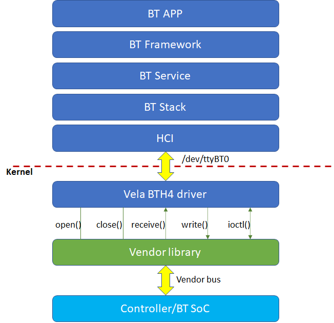

# 蓝牙概述

\[ [English](README.md) | 简体中文 \]

## 一、 openvela 蓝牙能力介绍

openvela 蓝牙已经通过 Bluetooth 5.4 认证。目前支持的蓝牙能力包括：

- Core

  - BR/EDR/BLE
  - GAP
  - L2CAP
  - GATT Client/Server
- A2DP SRC/SNK
- AVRCP CT/TG
- HFP AG/HF
- PAN
- SPP
- HID
- HOGP
- LEA

  - TMAP
  - CAP
  - BAP/ASCS/PACS/BASS
  - CSIP/CSIS
  - MCP/MCS
  - CCP/TBS
  - VCP/VCS
- Mesh

openvela 蓝牙目前还能够支持多种开源、闭源协议栈，如Zephyr、Bluez、Bluedroid、Barrot等。

## 二、 openvela 蓝牙应用开发

对于第三方应用开发者，可以使用 openvela  快应用 QuickApp Feature ，它是基于 QuickJS 引擎使用 C++ 实现的一系列 API 接口，为三方应用提供系统访问能力。

另外，还提供了 NDK 接口来使用蓝牙系统的所有能力。可以参阅目录 framework/include 中的头文件获取更多信息。

## 三、 openvela 蓝牙驱动开发

openvela 蓝牙支持多种驱动架构。以目前常用的 BTH4 驱动架构为例，芯片厂商可以实现一个 **struct bt_driver_s** 结构体类型的变量，并为其初始化以下成员函数：

- CODE int (*open)(FAR struct bt_driver_s *btdev);
- CODE int (*send)(FAR struct bt_driver_s *btdev, enum bt_buf_type_e type, FAR void *data, size_t len);
- CODE int (*ioctl)(FAR struct bt_driver_s *btdev, int cmd, unsigned long arg);
- CODE void (*close)(FAR struct bt_driver_s *btdev);

上面成员函数的实现依赖于 HCI 的实际工作方式，也就是 Host 和 Controller 之间的物理总线。

然后，将上述结构体类型的变量通过 API **bt_driver_register**()注册该驱动实例。

- int **bt_driver_register**(FAR struct bt_driver_s *drv);

类型定义可参考头文件 nuttx/include/nuttx/wireless/bluetooth/bt_driver.h。调用关系如下图所示：

备注：对于 receive() 成员函数，芯片厂商无需定义，BTH4 驱动会为其初始化。

- CODE int (*receive)(FAR struct bt_driver_s *btdev, enum bt_buf_type_e type, FAR void *data, size_t len);

当收到来自芯片的 HCI 数据时，只要调用 **bt_netdev_receive**()即可，它会调用这个 receive()函数来保存收到 HCI 数据。

